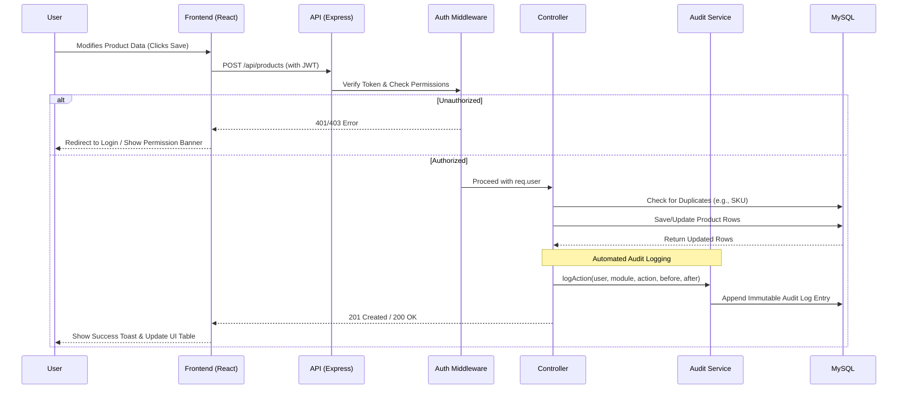

# Welcome Ceramic - Tiles Inventory Management System

Welcome Ceramic is a robust, full-stack enterprise application designed to streamline and automate the operations of a ceramic tiles business. Built with MySQL, Express.js, React, and Node.js, this system provides real-time visibility into inventory levels, granular role-based access controls, and tamper-proof security auditing.

## 🚀 Key Features

- **Granular Role-Based Access Control (RBAC):** Admins can dynamically grant or revoke specific module permissions (Products, Categories, Orders, Suppliers, etc.) for individual Staff members.
- **Comprehensive Stock Management:** Track tiles, sanitary ware, categories, sizes, and unit measurements. Low stock alerts are automatically generated on the dashboard.
- **Stock Movement Ledger:** A dedicated ledger tracks every "IN" and "OUT" movement of stock, automatically adjusting current quantities.
- **Purchase Orders & Suppliers:** Create purchase orders linked to specific suppliers. When items are "Received" via a purchase order, the stock is automatically updated in the database.
- **Immutable Audit Trail:** Every `CREATE`, `UPDATE`, and `DELETE` action performed by any user is automatically logged with timestamp, user ID, module name, and JSON diffs of the `before` and `after` states. This log is append-only and cannot be tampered with.
- **Modern UI/UX:** A responsive, dark-mode-ready interface built with Tailwind CSS, featuring smooth transitions, dynamic modals, and interactive data tables.

## 💻 Tech Stack

- **Frontend:** React.js, Tailwind CSS, React Router, React Toastify
- **Backend:** Node.js, Express.js, JWT Authentication
- **Database:** MySQL, mysql2

## 📁 File Structure

```text
tiles_inventory_management_system/
│
├── backend/                  # Express/Node.js Server
│   ├── config/               # Database connection setup
│   ├── controllers/          # API request handlers (Products, Users, etc.)
│   ├── middleware/           # JWT verification and Role authorization
│   ├── routes/               # Express API route definitions
│   ├── services/             # Background services (Audit Logging service)
│   ├── server.js             # Main server entry point
│   └── .env                  # Environment variables (DB URI, Port, Secrets)
│
└── frontend/                 # React Application
    ├── public/               # Static assets (Logos, index.html)
    ├── src/
    │   ├── components/       # Reusable UI components (DataTable, Modals, Buttons)
    │   ├── context/          # React Context (AuthContext for global state)
    │   ├── pages/            # Application views (Dashboard, Products, Users, Audit)
    │   ├── utils/            # Helper functions (apiCall wrapper)
    │   ├── App.js            # Main router and initialization logic
    │   └── index.css         # Tailwind global styles
    └── package.json          # Frontend dependencies
```

## 🔄 Application Architecture & Data Flow

The following flowchart illustrates the typical life cycle of a data modification request within the application.



## ⚙️ Installation & Setup

1. **Clone the repository** and navigate to the project root.
2. **Setup the Backend:**
   ```bash
   cd backend
   npm install
   ```
   Create a `.env` file in the `backend` directory:
   ```env
   PORT=5000
   MYSQL_HOST=localhost
   MYSQL_PORT=3306
   MYSQL_USER=root
   MYSQL_PASSWORD=your_mysql_password
   MYSQL_DATABASE=tiles_inventory_management
   JWT_SECRET=your_super_secret_key
   ```
3. **Setup the Frontend:**
   ```bash
   cd ../frontend
   npm install
   ```
4. **Run the Application (Development Mode):**
   Open two terminals:
   - Terminal 1 (Backend): `cd backend && npm run dev`
   - Terminal 2 (Frontend): `cd frontend && npm run dev`

5. **Initial Admin Access:**
   Ensure you have a MySQL server running. The backend will create the configured database and tables automatically if the MySQL user has the required privileges. The system requires an initial admin user to access the dashboard and assign roles.
